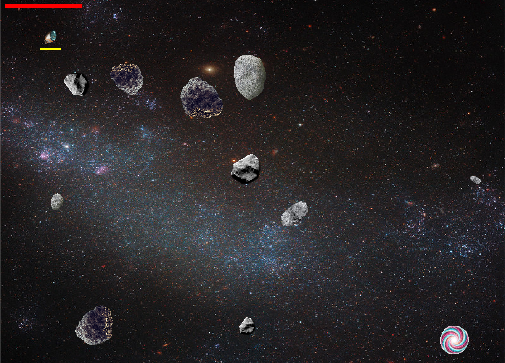
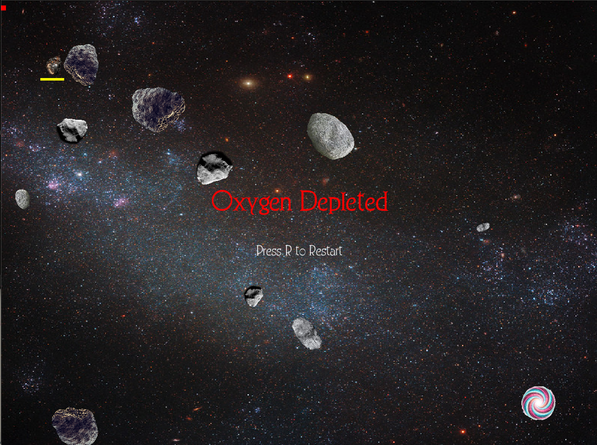
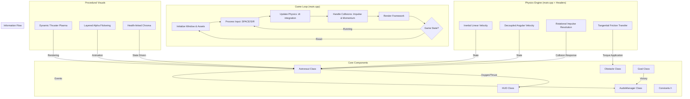

# Dying Astronaut

## The Backstory
This game was born from a moment of pure, misguided confidence after watching the movie [*Gravity*](https://www.youtube.com/watch?v=OiTiKOy59o4). I saw the high-stakes maneuvering and thought, "If I were an astronaut, I could totally pull that off." So I went through my high school physics notes and a few articles from the internet on inelastic and elastic collisions, I set out to build the ultimate space survival simulator.

**The result?** I quickly realized that space doesn't care about "video game skills". Between inelastic collisions, conservation of angular momentum, and the sheer terror of persistent inertia, I found out that I would have died instantly in the void. Turns out, spinning wildly into a giant rock is much harder to recover from than it looks on screen.

## Game Rules
Your ship is badly damaged, and your life support is failing. You have one goal: reach the wormhole before you run out of oxygen.

1. **Automatic Rotation**: Your rotation controls are fried. The ship spins continuously.
2. **Thrust**: Hold **SPACE** to engage the thrusters. The force is applied in whatever direction you’re currently facing.
3. **Asteroids**: Avoid them. Collisions cause oxygen leaks and send you spinning out of control.
4. **Wormhole**: Reach the glowing green portal to escape.
5. **Restart**: Press **R** to try again.

## Getting Started

### Prerequisites
- **SFML**: The Simple and Fast Multimedia Library is required. On macOS, you can install it via Homebrew:
  ```bash
  brew install sfml
  ```

### How to Run
1. Clone the repository.
2. Open your terminal in the project directory.
3. Run the following command to compile and launch the game:
   ```bash
   make
   ```
   *Note: The Makefile is configured for macOS (Apple Silicon). You may need to adjust the `SFML_DIR` path in the `Makefile` if your installation is different.*

## Technical Deep Dive: The Physics
The core of this game is a custom 2D physics engine built on top of SFML:

- **Inelastic Collisions**: Implemented using linear impulse resolution. When you hit an asteroid, kinetic energy is lost, and momentum is conserved.
- **Angular Momentum Transfer**: Collisions aren't just about bouncing; they transfer torque. Hitting an object tangentially will cause you (and the asteroid) to change spin based on mass and rotational inertia.
- **Persistent Inertia**: There is no "stop" button in space. Your linear and angular velocities persist until acted upon by thrust or another object.
- **Minimum Angular Velocity**: To prevent the player from getting "stalled" (facing one way forever), the ship maintains a guaranteed minimum spin (treat this as thrust from leaking oxygen).

## Libraries & Tools
- **SFML (Simple and Fast Multimedia Library)**: Used for window management, rendering, and audio.
- **C++17**: The core language for performance and modern syntax.
- **Procedural Graphics**: The thruster flames and plasma plumes are rendered dynamically using SFML primitives and harmonic oscillation for that sweet "flicker" effect.

*Created with love, bit of physics, and a healthy fear of the vacuum.*

## What I Learned
Honestly, building this game was a reality check. I used to think space movies made things look hard for "drama," but nope momentum is a cruel mistress. I learned that:

- **Physics is Harder Than It Looks:** Implementing **Inelastic Collisions** and **Conservation of Angular Momentum** taught me that angle is everything. If you hit an asteroid at just the right (wrong) angle, you're not just bouncing; you're becoming a human fidget spinner. Torque transfer is no joke!
- **SFML is a Gem:** Using SFML for windowing, rendering, and audio was a great experience. It handles the heavy lifting of multimedia while letting me focus on the core game logic and custom physics.
- **I Actually Like C++:** Call me crazy, but I really enjoy working with C++. I get why people might find it intimidating or "old school," but the control it gives you over memory and performance is unmatched. Plus, modern C++17 features make it feel much more streamlined than the versions I saw in older tutorials.
- **Patience is a Virtue:** Space doesn't have brakes. Every thrust is a commitment you have to live with.

> "A person who never made a mistake never tried anything new." — *Albert Einstein*

I am just a student learning things, one "critical mission failure" at a time!

## Media

### Launch Screen


### In-Game Action


### Mission Failure


### Gameplay Walkthrough
*assets/documentation/gameplay.mp4*


## Architecture
