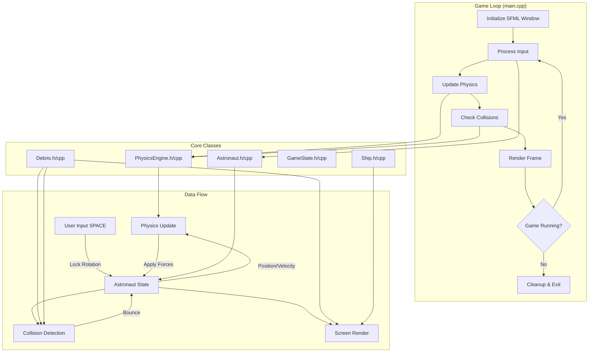

```mermaid
graph TB
    subgraph "Game Loop (main.cpp)"
        A[Initialize SFML Window]
        B[Process Input]
        C[Update Physics]
        D[Check Collisions]
        E[Render Frame]
        F{Game Running?}
        A --> B
        B --> C
        C --> D
        D --> E
        E --> F
        F -->|Yes| B
        F -->|No| G[Cleanup & Exit]
    end
    
    subgraph "Core Classes"
        H[Astronaut.h/cpp]
        I[Debris.h/cpp]
        J[Ship.h/cpp]
        K[GameState.h/cpp]
        L[PhysicsEngine.h/cpp]
    end
    
    subgraph "Data Flow"
        M[User Input SPACE]
        N[Astronaut State]
        O[Physics Update]
        P[Collision Detection]
        Q[Screen Render]
        
        M -->|Lock Rotation| N
        N -->|Position/Velocity| O
        O -->|Apply Forces| N
        N --> P
        I --> P
        P -->|Bounce| N
        N --> Q
        I --> Q
        J --> Q
    end
    
    B --> H
    C --> L
    D --> L
    H --> N
    I --> P
    L --> O
```