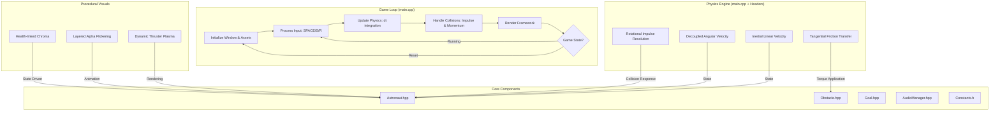

```mermaid
graph TB
    subgraph "Game Loop (main.cpp)"
        A[Initialize Window & Assets]
        B[Process Input: SPACE/S/R]
        C[Update Physics: dt integration]
        D[Handle Collisions: Impulse & Momentum]
        E[Render Framework]
        F{Game State?}
        A --> B
        B --> C
        C --> D
        D --> E
        E --> F
        F -->|Running| B
        F -->|Reset| A
    end
    
    subgraph "Core Components"
        H[Astronaut.hpp]
        I[Obstacle.hpp]
        J[Goal.hpp]
        K[AudioManager.hpp]
        L[Constants.h]
    end
    
    subgraph "Physics Engine (main.cpp + Headers)"
        M[Inertial Linear Velocity]
        N[Decoupled Angular Velocity]
        O[Rotational Impulse Resolution]
        P[Tangential Friction Transfer]
        
        M -->|State| H
        N -->|State| H
        O -->|Collision Response| H
        P -->|Torque Application| I
    end

    subgraph "Procedural Visuals"
        Q[Dynamic Thruster Plasma]
        R[Layered Alpha Flickering]
        S[Health-linked Chroma]
        
        Q -->|Rendering| H
        R -->|Animation| H
        S -->|State Driven| H
    end
```